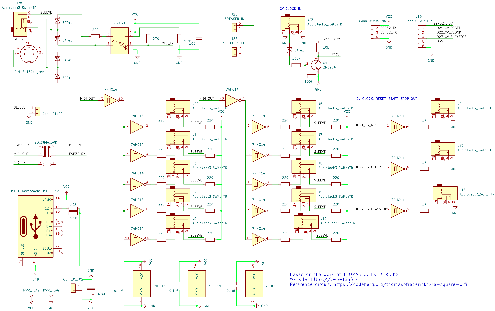
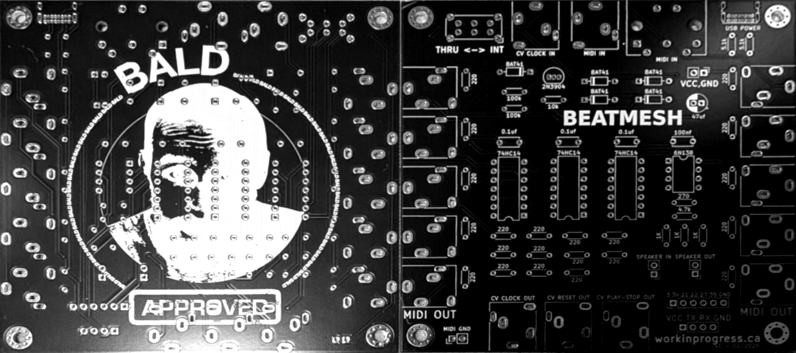
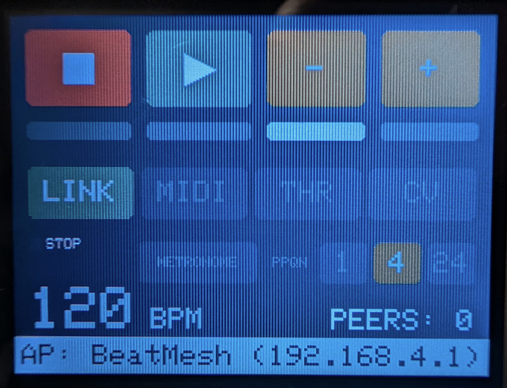
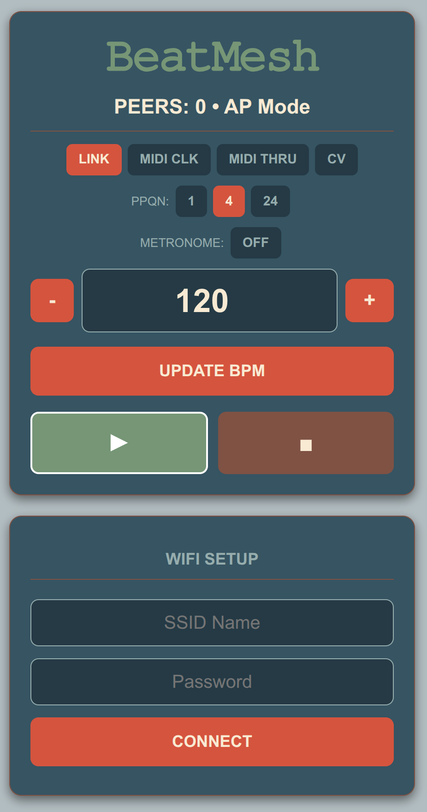

# BeatMesh

A module to synchronize via Ableton Link, MIDI, or CV clock. 

Built with PlatformIO and the ESP-IDF framework (espressif32), BeatMesh acts as a hub to keep your hardware and software locked in time.

## 🚀 Features

- **10x MIDI Out ports**
- **Flexible Routing:** Send raw MIDI to all 10 outputs OR filter to keep only the MIDI clock.
- **CV Integration:** CV clock, reset, and play-stop outputs.
- **Ableton Link:** Synchronize seamlessly over WiFi.

[](board/schematic.pdf)







---

## 🎛️ Custom PCB (KiCad)

The repository includes a production-ready printed circuit board designed in **KiCad 9**. You can find the source files (`.kicad_sch` and `.kicad_pcb`) in the `board/` directory.

### Hardware Design Highlights:
- **Form Factor:** 100mm x 100mm, 2-layer board (optimized for low-cost fabrication).
- **MIDI Input:** Fully opto-isolated using a **6N138** optocoupler. The circuit is properly level-shifted to send safe 3.3V logic to the ESP32, while powering the optocoupler with 5V for fast, reliable data transmission.
- **10x MIDI Outputs:** Buffered (using 2N3904 NPN transistors) and split to drive up to 10 distinct devices simultaneously without signal degradation. Designed with space-saving 3.5mm TRS jacks (SJ1-3515N).
- **CV / Sync Out:** Capable of sending analog clock, reset, and play/stop signals to Eurorack/modular gear. Includes **BAT41** Schottky diodes for signal protection.
- **CYD Integration:** Designed to interface cleanly with the Cheap Yellow Display (ESP32-2432S028R) ecosystem via standard 2.54mm pin headers.
- **Power Delivery:** Robust decoupling with 100nF ceramics and 47µF (25V) electrolytics to keep clock and CV paths stable and noise-free.

---

## 💻 Installation & Dependencies

> Built with ESP-IDF v5.5.0

External components live under `components/` as git submodules pinned to the versions used in this project:

| Submodule | Upstream | Pinned at |
|---|---|---|
| `components/asio/asio` | [chriskohlhoff/asio](https://github.com/chriskohlhoff/asio) | `asio-1-32-0` |
| `components/esp_abl_link` | [docwilco/esp_abl_link](https://github.com/docwilco/esp_abl_link) | `v3.1.5-1` |
| `components/esp_abl_link/vendor/ableton-link` | [Ableton/link](https://github.com/Ableton/link) | `Link-3.1.5` |
| `components/LovyanGFX` | [lovyan03/LovyanGFX](https://github.com/lovyan03/LovyanGFX) | `1.2.19` |

### Cloning

```bash
git clone --recurse-submodules https://github.com/patricksebastien/BeatMesh.git
```

If you already cloned without `--recurse-submodules`:

```bash
git submodule update --init --recursive
```

> Use `git config --global url."https://github.com/".insteadOf git@github.com:` if you don't have ssh key configured.

### ASIO Patch (Required)
To prevent the ESP32 from rebooting during transient network errors (e.g., `send_to ENOMEM`), ASIO needs a small patch. Link recovers from packet loss gracefully, so we do not want `std::terminate` to abort the program.

Apply the patch shipped in this repo:

```bash
git -C components/asio/asio apply ../../../patches/asio-esp32-rethrow-fix.patch
```

---

## ⚙️ Configuration Files

### 1. `platformio.ini`
Add the following to your environment configuration to ensure correct serial speeds, flash sizing, and ASIO compatibility:

```ini
monitor_speed = 115200
board_upload.flash_size = 4MB
board_build.partitions = huge_app.csv

build_flags = 
    -fexceptions
    -D ASIO_STANDALONE
    -D ASIO_NO_TYPEID
```

### 2. `huge_app.csv` (Partition Table)
Create this file in the root directory. Link and LovyanGFX make the binary quite large, so the default partition table is too small.

```csv
# Name,   Type, SubType, Offset,  Size, Flags
nvs,      data, nvs,     ,        0x4000,
otadata,  data, ota,     ,        0x2000,
phy_init, data, phy,     ,        0x1000,
factory,  app,  factory, ,        0x300000,
```

### 3. `sdkconfig.defaults`
Create this file in the root directory. These settings configure flash size/speed, enable C++ exceptions (required for ASIO/Link), and set the partition table layout.

```ini
# Flash Size & Speed (CYD has a 4MB Flash chip)
CONFIG_ESPTOOLPY_FLASHSIZE_4MB=y
CONFIG_ESPTOOLPY_FLASHFREQ_80M=y
CONFIG_ESPTOOLPY_FLASHMODE_QIO=y

# C++ Exceptions (Required for ASIO/Link)
CONFIG_COMPILER_CXX_EXCEPTIONS=y
CONFIG_COMPILER_CXX_RTTI=y

# Partition Table Layout
CONFIG_PARTITION_TABLE_SINGLE_APP_LARGE=y

# CPU Frequency (Ensure Link timing on Core 1 and Display/WiFi on Core 0 run smoothly)
CONFIG_ESP_DEFAULT_CPU_FREQ_240=y

# LWIP (Networking for Link - Multicast support is crucial)
CONFIG_LWIP_MAX_SOCKETS=16
CONFIG_LWIP_IGMP=y

# Common NVS/WiFi Settings
CONFIG_ESP_WIFI_AUTH_PHASE2_ENABLED=y
CONFIG_BT_ENABLED=n
```

### 4. `src/CMakeLists.txt`
Include the necessary libraries via `REQUIRES` so ESP-IDF links them properly:

```cmake
idf_component_register(SRCS "main.cpp"
                    INCLUDE_DIRS "."
                    REQUIRES LovyanGFX esp_http_server nvs_flash esp_wifi esp_event esp_abl_link)
```
